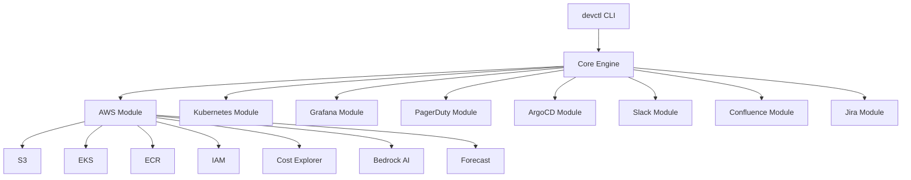

# devctl

A unified CLI for AWS, Grafana, GitHub, Kubernetes, PagerDuty, ArgoCD, Slack, Confluence, and compliance operations. Built for DevOps engineers who work across these platforms daily.

## Overview

devctl consolidates multiple DevOps tools into a single, consistent command-line interface. Instead of switching between `aws`, `kubectl`, `gh`, and various API calls, you get one unified experience with:

- **Consistent output formats** - Table, JSON, YAML across all commands
- **Layered configuration** - User defaults, project settings, environment variables
- **Cross-service workflows** - Combine operations across multiple platforms
- **Built-in intelligence** - AI-powered analysis and recommendations

## Quick Start

```bash
# Install
pip install -e .

# Set up configuration
cp config.example.yaml ~/.devctl/config.yaml

# Verify AWS access
devctl aws iam whoami

# List resources
devctl aws s3 ls
devctl aws eks list-clusters
```

## Architecture



## Key Features

| Feature | Description |
|---------|-------------|
| **Multi-cloud AWS** | IAM, S3, ECR, EKS, Cost Explorer, CloudWatch, Bedrock, Forecast |
| **Kubernetes** | Pod management, deployments, events, resource inspection |
| **Observability** | Grafana dashboards, alerts, annotations |
| **Incident Management** | PagerDuty incidents, on-call schedules |
| **GitOps** | ArgoCD application sync, diff, rollback |
| **Communication** | Slack messages, Confluence pages |
| **Compliance** | PCI DSS scanning, access reviews |
| **Automation** | YAML workflows with Jinja2 templating |

## Command Structure

```
devctl
├── aws          # AWS services (IAM, S3, ECR, EKS, Cost, Bedrock, Forecast)
├── grafana      # Dashboards, alerts, annotations
├── github       # Repos, PRs, issues, actions
├── jira         # Issues, boards, sprints
├── k8s          # Pods, deployments, nodes, events
├── pagerduty    # Incidents, on-call, schedules
├── argocd       # Application management
├── logs         # Unified log search
├── runbook      # Executable runbooks
├── deploy       # Blue/Green, Canary, Rolling deployments
├── slack        # Messages, notifications
├── confluence   # Pages, search, publishing
├── compliance   # PCI scanning, access reviews
├── ops          # Health checks, cost reports
└── workflow     # YAML workflow engine
```

## Global Options

All commands support these global options:

| Option | Description |
|--------|-------------|
| `-p, --profile` | Configuration profile |
| `-o, --output` | Output format: table, json, yaml, raw |
| `-v, --verbose` | Increase verbosity (-v, -vv, -vvv) |
| `-q, --quiet` | Suppress non-essential output |
| `--dry-run` | Preview without executing |
| `--no-color` | Disable colored output |

## Next Steps

- [Getting Started](getting-started.md) - Installation and first commands
- [Configuration](configuration.md) - Profiles and credentials
- [AWS Commands](aws-commands.md) - Complete AWS reference
- [Kubernetes](kubernetes.md) - Pod and deployment management
